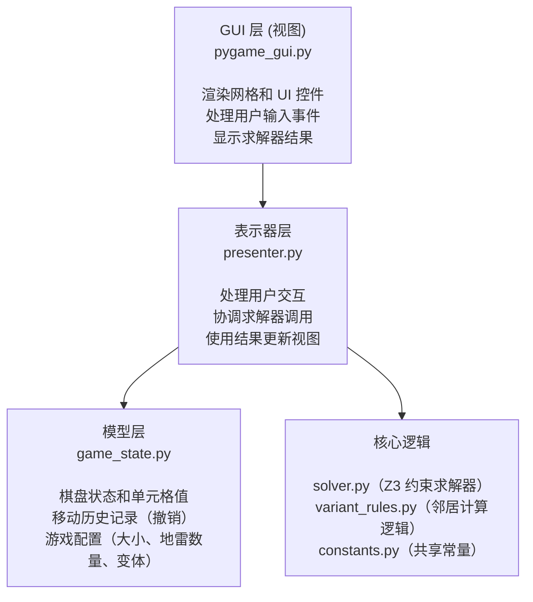

# Z3 扫雷求解器

> **⚠️ AI参与提示**：本项目在开发过程中使用了AI辅助编程。
>
> 本项目不是游戏，是游戏 [14种扫雷变体](https://store.steampowered.com/app/1865060/14/) 的辅助求解器。
>
> 仅做学习交流使用，过度使用可能会降低游戏趣味性。

一个使用 [Z3定理证明器](https://github.com/z3prover) 来确定安全单元格和地雷的扫雷求解器，具有数学确定性。该应用程序支持多种游戏变体，并提供交互式 GUI 用于谜题输入和求解。

**🌐 语言**: **中文** | [English Version](README.md)

## 功能特点

- **精确求解器**：使用 `Z3` 约束求解来找到逻辑上确定的移动
- **多种变体**：支持标准、骑士和曼哈顿邻居规则
- **交互式 GUI**：基于 Pygame 的界面，便于谜题输入
- **撤销支持**：Ctrl+Z 撤销上一步操作
- **可配置网格**：可调整网格大小（5x5 至 8x8）和地雷数量
- **视觉反馈**：高亮显示安全单元格（绿色）和地雷单元格（红色）

## 架构

本项目采用 **模型-视图-表示器 (MVP)** 架构：



## 项目结构

```txt
v-14-mine/
├── main.py              # 应用程序入口点
├── core/
│   ├── __init__.py
│   ├── solver.py        # Z3 约束求解器
│   ├── variant_rules.py # 邻居计算逻辑
│   └── constants.py     # 核心常量（单元格状态、变体）
└── gui/
    ├── __init__.py
    ├── pygame_gui.py    # Pygame 视图实现
    ├── presenter.py     # MVP 表示器
    ├── game_state.py    # 游戏状态模型
    └── constants.py     # GUI 颜色和样式
```

## 游戏变体

求解器支持多种邻居计算变体：

- **标准**：8 个邻居（相邻和对角单元格）
- **骑士**：8 个骑士移动（仅 L 形）
- **曼哈顿**：标准 8 个 + 4 个距离为 2 的正交单元格
- **负雷**：8 个邻居在棋盘格染色下，两种颜色的雷的数量的差的绝对值

未完待续（也许）

## 安装

### 要求

- Pygame
- Z3 Solver

### 安装依赖

```bash
pip install -r requirements.txt
```

## 使用方法

### 运行应用程序

```bash
python main.py
```

### 控制操作

- **左键点击**：循环切换单元格值（未知 → 0 → 1 → 2 → ... → 8 → 未知）
- **右键点击**：在单元格上切换旗帜标记
- **Ctrl+Z**：撤销上一步操作
- **规则按钮**：下拉切换变体
- **大小**：下拉选择网格大小（正方形网格）
- **地雷**：手动输入或 +/- 调整总地雷数量
- **重置**：清空棋盘
- **求解**：运行 Z3 求解器，查找可以确定的格子

### 单元格状态

- **未知 (-1)**：灰色单元格，未揭开
- **旗帜 (-2)**：单元格标记有红色的 "F"
- **已揭开 (0-8)**：白色单元格，显示数字（相邻地雷数量）
- **问号**：问号，表示一个未知的数字，不是雷

### 求解器输出

- **绿色高亮**：确定安全的单元格
- **红色高亮**：确定是地雷的单元格

## 求解器工作原理

求解器使用 `Z3` 创建一个约束满足问题：

1. 为每个单元格创建一个布尔变量（是否为地雷）
2. 为已揭开的单元格添加约束（相邻地雷之和 = 单元格值）
3. 可选地添加总地雷数量约束
4. 对于每个未知单元格，测试它是否必须是地雷或必须是安全的
5. 返回所有可以确定性的单元格

## 添加新变体

- 将变体名称添加到 `core/constants.py`：

```python
VARIANT_CUSTOM = "Custom"
VARIANT_TYPES.append(VARIANT_CUSTOM)
```

- 在 `core/variant_rules.py` 中添加邻居逻辑：

```python
elif variant_type == VARIANT_CUSTOM:
    offsets = [your_custom_offsets]
```
