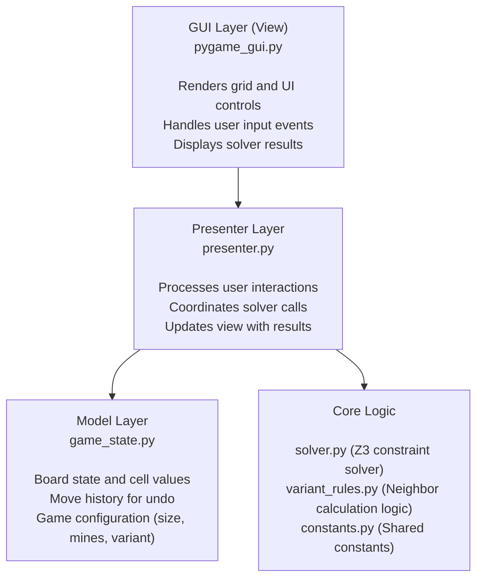

# Z3 Minesweeper Solver

> **⚠️ AI-Assisted Development**: This project was developed with AI assistance.

A Minesweeper puzzle solver that uses the Z3 theorem prover to determine safe cells and mines with mathematical certainty. The application supports multiple game variants and provides an interactive GUI for puzzle input and solving.

**🌐 Language**: [中文版](README-CN.md) | **English**

## Features

- **Exact Solver**: Uses Z3 constraint solving to find logically certain moves
- **Multiple Variants**: Supports Standard, Knight, and Manhattan neighbor rules
- **Interactive GUI**: Pygame-based interface for easy puzzle input
- **Undo Support**: Ctrl+Z to undo moves
- **Configurable Grid**: Adjustable grid size (5x5 to 8x8) and mine count
- **Visual Feedback**: Highlights safe cells (green) and mine cells (red)

## Architecture

The project follows the **Model-View-Presenter (MVP)** architecture:



## Project Structure

```txt
v-14-mine/
├── main.py              # Application entry point
├── core/
│   ├── __init__.py
│   ├── solver.py        # Z3 constraint solver
│   ├── variant_rules.py # Neighbor calculation logic
│   └── constants.py     # Core constants (cell states, variants)
└── gui/
    ├── __init__.py
    ├── pygame_gui.py    # Pygame view implementation
    ├── presenter.py     # MVP presenter
    ├── game_state.py    # Game state model
    └── constants.py     # GUI colors and styles
```

## Game Variants

The solver supports four neighbor calculation variants:

1. **Standard**: 8 neighbors (adjacent and diagonal cells)
2. **Knight**: Standard 8 + 8 knight moves (L-shaped)
3. **Manhattan**: Standard 8 + 4 orthogonal cells at distance 2
4. **OddEven**: The absolute value of the difference between the number of mines on odd and even colored cells (checkerboard coloring) among the 8 neighbors

## Installation

### Requirements

- Python 3.12+
- Pygame
- Z3 Solver

### Install Dependencies

```bash
pip install -r requirements.txt
```

## Usage

### Running the Application

```bash
python main.py
```

### Controls

- **Left Click**: Cycle cell through values (unknown → 1 → 2 → ... → 8 → 0 → unknown)
- **Right Click**: Toggle flag on cell
- **Ctrl+Z**: Undo last move
- **Rule Button**: Cycle through variants (Standard → Knight → Manhattan)
- **Size +/-**: Adjust grid size (maintains square grid)
- **Mines +/-**: Adjust total mine count
- **Reset**: Clear the board
- **Solve**: Run Z3 solver to find certain moves

### Cell States

- **Unknown (-1)**: Gray cell, unrevealed
- **Flag (-2)**: Cell marked with "F" in red
- **Revealed (0-8)**: White cell with number (adjacent mine count)

### Solver Output

- **Green Highlight**: Cells that are definitely safe
- **Red Highlight**: Cells that are definitely mines

## How the Solver Works

The solver uses `Z3` to create a constraint satisfaction problem:

1. Creates a boolean variable for each cell (mine or not)
2. Adds constraints for revealed cells (sum of neighboring mines = cell value)
3. Optionally adds total mine count constraint
4. For each unknown cell, tests if it must be a mine or must be safe
5. Returns all cells that can be determined with certainty

## Adding New Variants

- Add variant name to `core/constants.py`:

```python
VARIANT_CUSTOM = "Custom"
VARIANT_TYPES.append(VARIANT_CUSTOM)
```

- Add neighbor logic in `core/variant_rules.py`:

```python
elif variant_type == VARIANT_CUSTOM:
    offsets = [your_custom_offsets]
```
