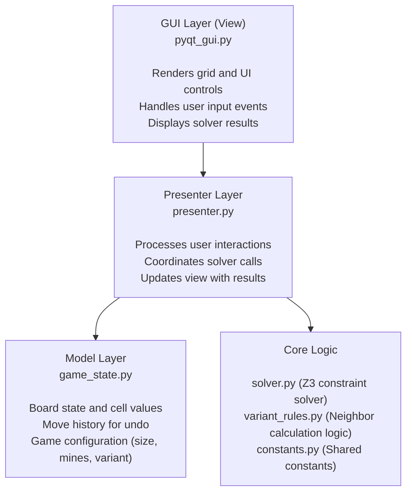

# Z3 Minesweeper Solver

> **⚠️ AI-Assisted Development**: This project was developed with AI assistance.
>
> This project is not a game, but an assistant solver for the game [14 Minesweeper Variants](https://store.steampowered.com/app/1865060/14/).
>
> For learning and exchange purposes only. Overuse may reduce game enjoyment.

A Minesweeper puzzle solver that uses the Z3 theorem prover to determine safe cells and mines with mathematical certainty. The application supports multiple game variants and provides an interactive GUI for puzzle input and solving.

**🌐 Language**: [中文版](README-CN.md) | **English**

## Features

- **Exact Solver**: Uses Z3 constraint solving to find logically certain moves
- **Multiple Variants**: Supports Standard, Knight, and OddEven neighbor rules
- **Interactive GUI**: PyQt-based interface for easy puzzle input
- **Undo Support**: Ctrl+Z to undo moves
- **Configurable Grid**: Adjustable grid size (5, 6, 7, 8) and mine count
- **Image Recognition**: Capture and automatically recognize game boards from screenshots
- **Visual Feedback**: Highlights safe cells (green) and mine cells (red)
- **Question Mark Support**: Mark cells with "?" to indicate unknown numbers (not mines)

## Architecture

The project follows the **Model-View-Presenter (MVP)** architecture:


```mermaid
flowchart TB

    View["GUI Layer (View)<br/>pyqt_gui.py<br/><br/>Renders grid and UI controls<br/>Handles user input events<br/>Displays solver results"]

    Presenter["Presenter Layer<br/>presenter.py<br/><br/>Processes user interactions<br/>Coordinates solver calls<br/>Updates view with results"]

    Model["Model Layer<br/>game_state.py<br/><br/>Board state and cell values<br/>Move history for undo<br/>Game configuration (size, mines, variant)"]

    Core["Core Logic<br/><br/>solver.py (Z3 constraint solver)<br/>variant_rules.py (Neighbor calculation logic)<br/>constants.py (Shared constants)"]

    View --> Presenter
    Presenter --> Model
    Presenter --> Core
```

## Project Structure

```txt
v-14-mine/
├── main.py              # Application entry point
├── core/
│   ├── __init__.py
│   ├── solver.py        # Z3 constraint solver
│   ├── variant_rules.py # Neighbor calculation logic
│   └── constants.py     # Core constants (cell states, variants)
├── models/
│   ├── __init__.py
│   └── game_state.py    # Game state model
└── gui/
    ├── __init__.py
    ├── pyqt_gui.py      # PyQt view implementation
    ├── presenter.py     # MVP presenter
    └── constants.py     # GUI colors and styles
```

## Game Variants

The solver supports multiple neighbor calculation variants:

- **Standard**: 8 neighbors (adjacent and diagonal cells)
- **Knight**: 8 knight moves (L-shaped only)
- **OddEven**: The absolute value of the difference between the number of mines on odd and even colored cells (checkerboard coloring) among the 8 neighbors
- **Cross**: 4 orthogonal neighbors (up, down, left, right)
- **Partition**: Number of contiguous mine groups in the ring of 8 neighbors

## Installation

### Requirements

- Python 3.9+
- PyQt6
- Z3 Solver
- numpy
- opencv-python
- pillow
- pytesseract

### Install Dependencies

This project uses [uv](https://docs.astral.sh/uv/) for dependency management.

```bash
# Install uv (if not already installed)
curl -LsSf https://astral.sh/uv/install.sh | sh

# Create virtual environment and install dependencies
uv sync
```

## Usage

### Running the Application

```bash
python main.py
```

### Controls

- **Left Click**: Cycle cell through values (unknown → 0 → 1 → 2 → ... → 8 → unknown)
- **Right Click**: Toggle flag on cell
- **Ctrl+Z**: Undo last move
- **Rule Button**: Dropdown to switch variants
- **Size**: Dropdown to select grid size (5, 6, 7, 8)
- **Mines**: Manual input or +/- to adjust total mine count
- **Reset**: Clear the board
- **Solve**: Run Z3 solver to find certain moves

### Cell States

- **Unknown (-1)**: Gray cell, unrevealed
- **Flag (-2)**: Cell marked with "F" in red
- **Revealed (0-8)**: White cell with number (adjacent mine count)
- **Question Mark**: Question mark, indicates an unknown number, not a mine

### Solver Output

- **Green Highlight**: Cells that are definitely safe
- **Red Highlight**: Cells that are definitely mines

## How the Solver Works

The solver uses `Z3` to create a constraint satisfaction problem:

1. Creates a boolean variable for each cell (mine or not)
2. Adds constraints for revealed cells (sum of neighboring mines = cell value)
3. Optionally adds total mine count constraint
4. For each unknown cell, tests if it must be a mine or must be safe
5. Returns all cells that can be determined with certainty

## Adding New Variants

- Add variant name to `core/constants.py`:

```python
VARIANT_CUSTOM = "Custom"
VARIANT_TYPES.append(VARIANT_CUSTOM)
```

- Add neighbor logic in `core/variant_rules.py`:

```python
elif variant_type == VARIANT_CUSTOM:
    offsets = [your_custom_offsets]
```
